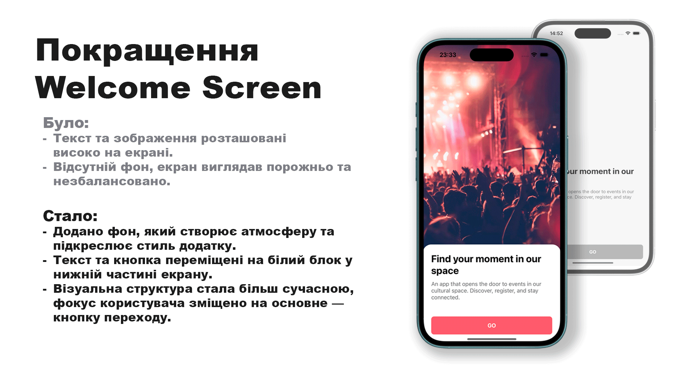
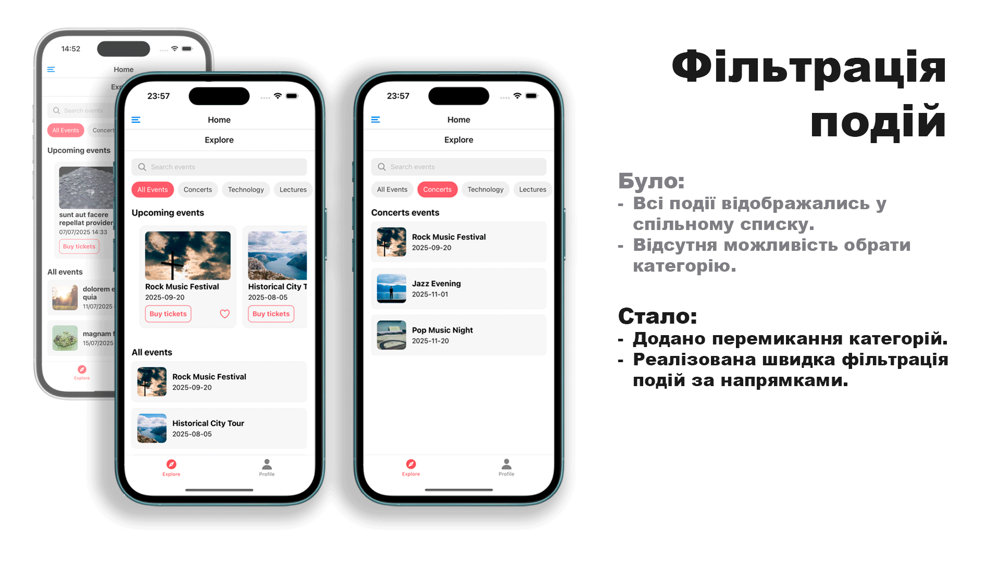
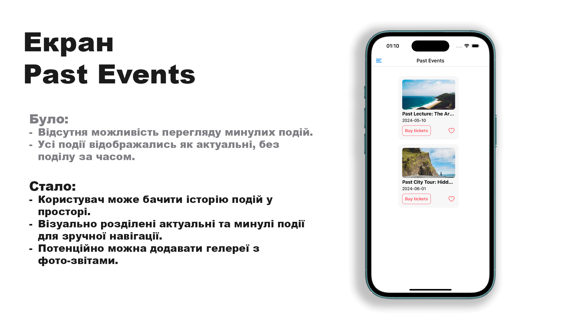
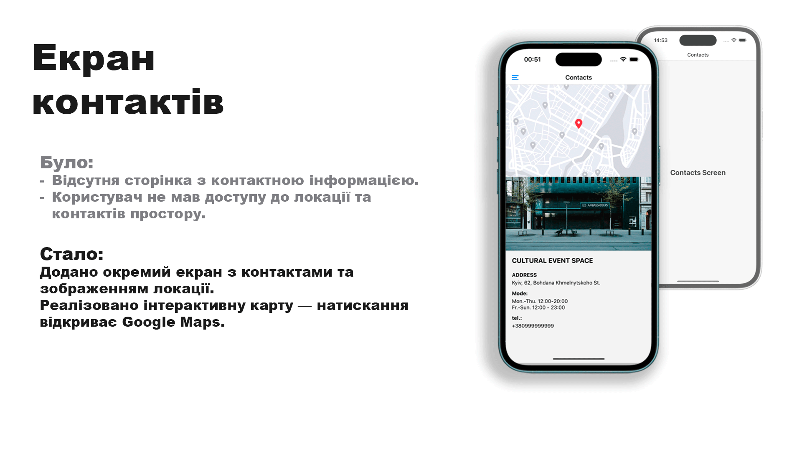

# 📱 Культурний мобільний застосунок

## Опис проєкту

Це мобільний застосунок для відвідувачів культурних подій у місті. Проєкт розроблений у межах навчального курсу та є вдосконаленою версією початкового застосунку з розширеним функціоналом і покращеним інтерфейсом.

---

## Аналіз наявного застосунку

У початковій версії (\_cross_assignment_7) застосунок мав базову навігацію та екран перегляду подій. Основна функціональність:

- Перегляд усіх івентів.
- Детальна сторінка події.
- Можливість додати подію в обране.

### Виявлені зони для розширення:

- Відсутність можливості фільтрувати події за категоріями.
- Відсутній розділ для перегляду минулих подій.
- Відсутній екран реєстрації для участі у подіях.
- Недостатньо інформації про локацію та контакти.

---

## Внесені покращення

### 📌 Нові функції:

- Додано **фільтрацію подій за категоріями**.
- Додано **екран Past Events** для перегляду минулих подій.
- Додано **екран Contacts** з інтерактивною картою та можливістю перейти в Google Maps.
- Реалізовано **екран реєстрації** з формою та переходом на профіль після реєстрації.

### 📌 Управління станом:

- Глобальний стан реалізований за допомогою **Redux**:
  - Збереження обраних подій.
  - Збереження усіх подій.
- Для управління темами використовується **Context API**.

### 📌 Покращення UI/UX:

- Оптимізована навігація між екранами (Drawer, Stack, Tab).
- Фільтрація працює з плавним оновленням списків.
- Відцентровані та адаптивні картки подій.
- Підтримка темної теми на ключових екранах.
- Адаптований вигляд Past Events із гарними відступами та повною шириною карток.

---

## 🔗 Основні екрани застосунку:

- Welcome Screen
- Explore (фільтрація подій)
- Past Events
- Contacts
- Event Details
- Favorites
- Registration
- Profile

---

## Скріншоти

- Головний екран
  
- 
- 
- 
- 

---

## Структура проєкту

Проєкт побудований за компонентним підходом:

- **Компоненти:** EventCard, EventListItem, CategoryBadge, SearchBar, PrimaryButton
- **Глобальні контексти:** ThemeContext
- **Сторінки:** ExploreScreen, EventDetailsScreen, PastEventsScreen, ContactsScreen, RegisterScreen, ProfileScreen

---

## Запуск проєкту

```bash
npx expo start
```
